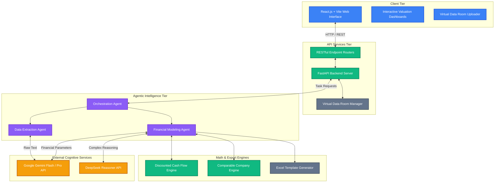
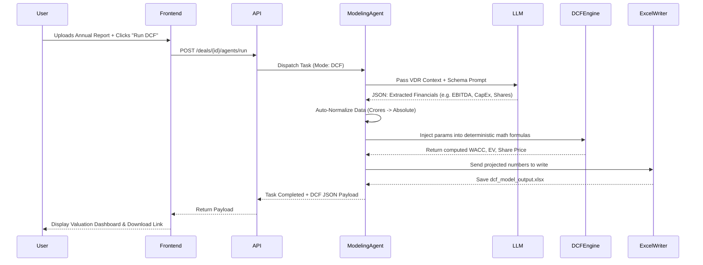

# AI Investment Banking Analyst Agent (AIBAA)
## System Architecture Overview

This document provides a highly visual and logically structured breakdown of the system architecture empowering the AIBAA platform. The architecture is segregated into modular layers, ensuring scalability, maintainability, and clear separation of concerns.

### High-Level Component Diagram

### 1. Client Tier (Frontend)
- **Technology**: React.js, Vite, Tailwind CSS, Lucide Icons.
- **Responsibility**: Provides an intuitive, enterprise-grade dark-themed UI for investment bankers. It handles file uploads (Virtual Data Room), visualizes the outputs of financial models (Enterprise Value bridges, sensitivity matrices), and tracks agent task status in real-time.

### 2. API Services Tier (Backend)
- **Technology**: Python, FastAPI, Uvicorn.
- **Responsibility**: Securely handles client HTTP requests. It acts as the gateway to the agentic system. It also manages in-memory data states via `store.py` (simulating a database for prototype speed) and organizes uploaded financials.

### 3. Agentic Intelligence Tier (AI Core)
- **Technology**: Custom Python Agent Framework (`agents/`).
- **Responsibility**: Mimics the workflow of human analysts.
  - **Orchestrator**: Determines which specialized agent is needed for a user request.
  - **Extractor**: Reads raw scraped text from PDFs/JSONs, normalizing and sanitizing the context.
  - **Modeller**: Acts as the senior financial analyst. It prompts the LLMs to extract core variables (Shares, Debt, EBITDA, CapEx), auto-normalizes mismatched units (Crores vs Absolute), and feeds them into the deterministic math engines.

### 4. Math & Export Engines
- **Technology**: Pyndantic, OpenPyXL, Python Math libraries.
- **Responsibility**: While LLMs are great at text, they hallucinate math. The `dcf.py` engine takes structured data from the Modeller and runs rigorous, error-free Discounted Cash Flow math. Outputs are then serialized into professional `.xlsx` artifacts using `excel_writer.py`.

### 5. External Cognitive Services
- **Technology**: Direct LLM API integrations (`llm.py`).
- **Responsibility**: Provides the "brain". The backend sends highly engineered prompts along with financial context to Google Gemini (or NVIDIA/DeepSeek endpoints) to intelligently extract and infer data.

---

### Sequence: How a Financial Model is Built

